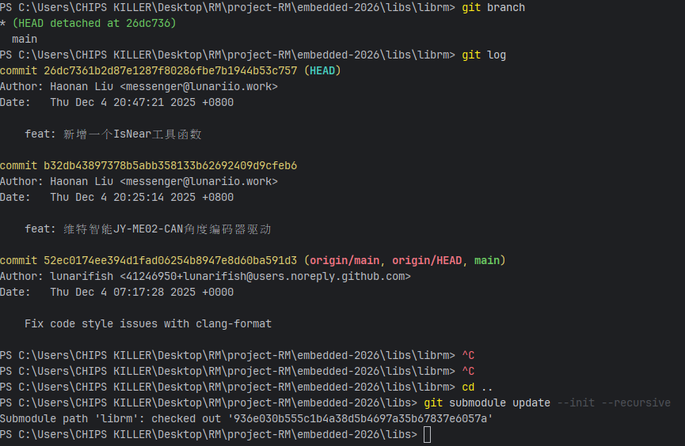

# 创建对象

> - 传感器等需要时间初始化的外设，使用这种方法在HAL库初始化完之后创建对象

> ## C++编译时会先初始化变量，因为librm库变量是写到globals中的，而globals是一个全局指针，在globals在主进程中被new之前直接调用globals中变量的话，会使用globals指针，而此时globals未被new，会造成空指针，从而进入HardFault
---
# git合并报错

> ### 关键点总结
> - 主仓库操作：在特性分支开发，合并main分支更新
> - 子模块问题：子模块处于分离头指针状态，版本不一致
> - 修复方法：使用git submodule update --init --recursive同步到正确版本
> - 最佳实践：子模块应始终跟踪分支，避免直接检出特定提交