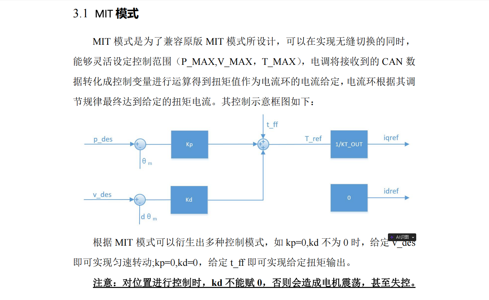

# 电机理解
- 这个电机内置了处理器，不用直接控制其电流，可以直接给其发送速度、位置、转矩指令，其内部处理器会进行处理达到目标，从而减轻上位机计算压力。
# T_ff转矩给定值参数
- 映射关系
  - 
  - T_ff为直接给定的转矩（力），是开环控制，位置控制和速度控制都是通过转矩来控制的
---
# CAN控制
- MIT控制
- 操作流程
  - 1、使能
  - 2、数据
    - MIT模式下由于需使用浮点数进行控制，但二进制传输不方便传输浮点数，所以在上位机和电机之间需要一个转码，在传输过程中使用整数，在上位机和电机上使用浮点数。
  - 3、失能
---
# 实验
## 使用 librm 库
### 问题
- 没转
  - 1、CAN发送接收Id错误
  - 2、达妙调试器CAN接口和C板CAN接口是反的
  - 3、直接查看CAN线消息发了没
    - 等待CAN转USB调试器中
    - CAN消息似乎没发送出去，通过环回测试没有进到接收中断
  - 4、似乎有些别的参数会影响MIT模式下的数据传输，但不应该影响使能啊
    - 明天
      - 1、弄好CAN转USB，看看到底发送出去没，发了什么
        - 没发送出去则，额···
          - 换块板子
        - 发送出去则，额···
          - 再看看协议和线路吧···
      - 2、自己编一个简单的使能
        - 按照官方的例程编了一个，不太行，没使能成功，cangaroo也接收不到
        - 